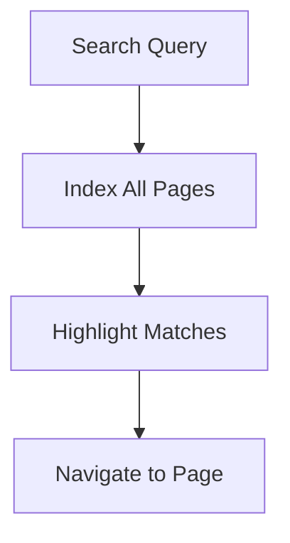

## Overview

Aéroclub Air France - Toulouse's documentation space provides essential tools to manage your project documentation efficiently. You can organize content hierarchically, track changes with version control, collaborate in real-time, and leverage search plus templating for quick setups.

<Columns cols={2}>
  <Card title="Organization Tools" icon="folder" href="#organization">
    Structure your docs with nested pages and clear hierarchies.
  </Card>
  <Card title="Version Control" icon="git-branch" href="#version-control">
    Edit safely with history tracking and rollback options.
  </Card>
  <Card title="Collaboration" icon="users" href="#collaboration">
    Share, comment, and co-edit with your team.
  </Card>
  <Card title="Search & Templates" icon="search" href="#search-templates">
    Find content fast and bootstrap new pages easily.
  </Card>
</Columns>

## Document Organization and Hierarchies

Organize your documentation into logical structures using folders, pages, and subpages. This creates intuitive navigation for users.

<Steps>
  <Step title="Create Folders" icon="folder-plus">
    Navigate to your workspace and select `New Folder` to group related topics.

````markdown
// Example folder structure
docs/
  ├── pilots/
  │   ├── training.mdx
  │   └── flights.mdx
  └── maintenance/
      └── checklists.mdx
````
  </Step>
  <Step title="Add Pages" icon="file-plus">
    Inside folders, create MDX pages with frontmatter for metadata.
  </Step>
  <Step title="Set Hierarchies" icon="hierarchy">
    Use sidebar navigation to reflect your page tree automatically.
  </Step>
</Steps>

<Callout kind="tip">
  Use consistent naming like `{topic}-{subtopic}` for easy scanning.
</Callout>

## Version Control and Editing Tools

Track changes across your documentation with built-in version history. Edit in rich text or markdown modes.

<Tabs>
  <Tab title="Markdown Editor" icon="code">
    Write raw MDX for full control.

````mdx
---
title: Flight Log
description: Track pilot hours.
---

## Recent Flights

| Date | Pilot | Hours |
|------|-------|-------|
| 2024-01-15 | J. Dupont | 2.5 |
````
  </Tab>
  <Tab title="Visual Editor" icon="edit-3">
    Drag-and-drop components without code.
  </Tab>
</Tabs>

<CodeGroup tabs="CLI,Web">
```bash
# CLI: Pull latest changes
git pull origin main

# Commit your edits
git add docs/
git commit -m "Update training section"
```
```javascript
// Web API: Fetch revisions
const revisions = await fetch('/api/pages/flights/revisions');
```
</CodeGroup>

## Collaboration and Sharing Features

Invite team members to co-edit and review docs. Share public links or embed pages.

<Expandable title="Sharing Options" default-open="true">
  - **Public Links**: Generate shareable URLs for read-only access.
  - **Team Permissions**: Assign roles like Editor or Viewer.
  - **Comments**: Add inline feedback on any section.

  Example permission setup:

````json
{
  "page": "/docs/pilots/training",
  "roles": {
    "editor": ["instructor@example.com"],
    "viewer": ["pilot@example.com"]
  }
}
````
</Expandable>

## Search and Templating Functionalities

Quickly find content with full-text search across all pages. Use templates to standardize new documents.



<Callout kind="info">
  Save frequent searches as bookmarks for your dashboard.
</Callout>

<Tabs>
  <Tab title="Create Template" icon="file-text">
    Design reusable page layouts.

````mdx
<Callout kind="success">
  Starter template content here.
</Callout>

## Sections

Add your H2 content.
````
  </Tab>
  <Tab title="Apply Template" icon="plus-circle">
    Select from library when creating new pages.
  </Tab>
</Tabs>

Ready to build? Start with [organization](#organization) or explore [collaboration](#collaboration) next.